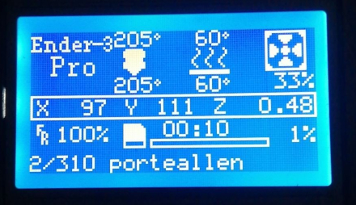

# Display current layer and filename for Ender3 (Cura)

This plugin displays the layer count and the filename on the screen of 3D printers (Ender 3, Ender 3 Pro, etc.).

This is a modification of the original plugin that allows compact display.

E.g. `2/310 porteallen`
+ `2/310` current layer is 2 out of 310
+ `porteallen` filename

An option allows to remove the prefix that Cura adds (`CE3_`, `CE3PRO_`, etc.)

## Installation

On Linux, add `CompactLayersCount.py` in `~/.local/share/cura/[CURA VERSION]/scripts`.  
On Windows, add this file somewhere around `C:\[Cura path]\plugins\PostProcessingPlugin\scripts\`. But I didn't tested it ¯\\\_(ツ)\_/¯
